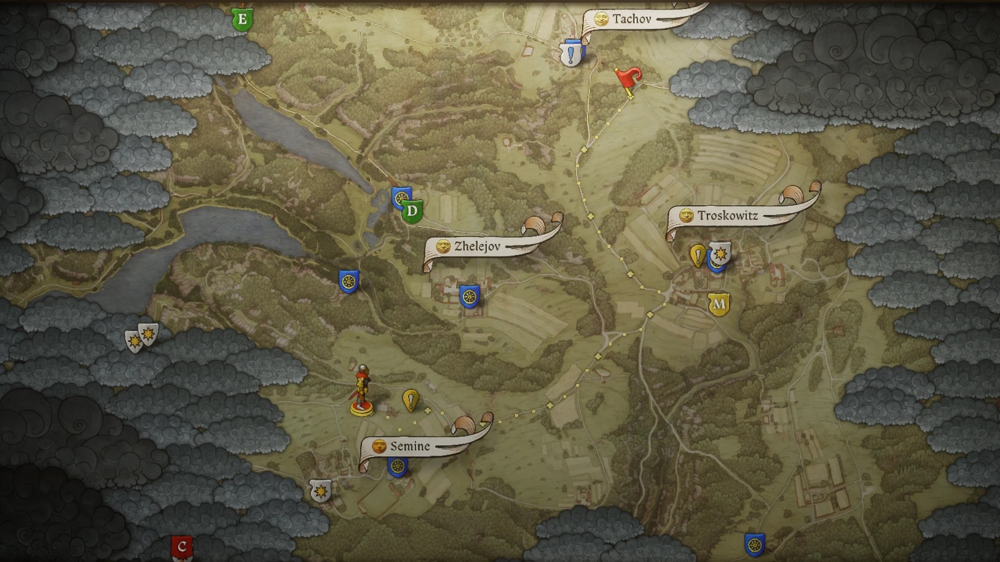

# KCD2 Mods - Theatrical AutoForge, Theatrical Autobrew, Horse Route Follow

Native (C++) mods for **Kingdom Come: Deliverance II**, loaded by the
[Kingdom Come Script Extender (KCSE)](https://www.nexusmods.com/kingdomcomedeliverance2/mods/3332).

| Mod | What it does | Key |
|---|---|---|
| **[Horse Route Follow](https://www.nexusmods.com/kingdomcomedeliverance2/mods/3742)** | Horse auto-follow takes the right turn at every fork to reach your custom map marker. The route is drawn on the map like fast travel, the route is recalculated only if you leave it, and the horse stops on the road closest to the marker. Always on while a marker is placed. | none |
| **Hardcore Map Markers** (optional file of Horse Route Follow) | Allows custom map markers in hardcore mode (map only, not the compass), so Horse Route Follow works there too. | none |
| **[Theatrical AutoForge](https://www.nexusmods.com/kingdomcomedeliverance2/mods/3743)** | Henry forges the chosen piece himself, stroke by stroke: heating, bellows, hammering in rhythm, flipping, reheating and quench - all through the game's own forge actions. | F9 |
| **[Theatrical Autobrew](https://www.nexusmods.com/kingdomcomedeliverance2/mods/3744)** | Henry brews the recipe open in the alchemy book on screen, step by step and in real time. **An adaptation of [Autobrew](https://www.nexusmods.com/kingdomcomedeliverance2/mods/3394) by JerryYOJ** (see below). | F8 |



> Most of the code and text in this project was written with AI assistance (Claude); the mods are tagged accordingly on Nexus.
>
> These are our first mods for this game and have been tested on one setup (Steam, game 1.5.x build 15693).
> Expect issues we have not run into yet - bug reports with the mod's log are very welcome.

## Download and install

Downloads, install instructions and support are on Nexus Mods:
[Horse Route Follow](https://www.nexusmods.com/kingdomcomedeliverance2/mods/3742) -
[Theatrical AutoForge](https://www.nexusmods.com/kingdomcomedeliverance2/mods/3743) -
[Theatrical Autobrew](https://www.nexusmods.com/kingdomcomedeliverance2/mods/3744)
Each mod needs:

- [Kingdom Come Script Extender (KCSE)](https://www.nexusmods.com/kingdomcomedeliverance2/mods/3332) by JerryYOJ
- [Address Library For KCSE](https://www.nexusmods.com/kingdomcomedeliverance2/mods/3381) by JerryYOJ (required by KCSE)

The user-facing README of each mod (usage, settings, known issues) is in [`docs/`](docs).

## Update safety

The mods do not use fixed memory addresses. At startup they locate the game code they need by byte
signature (rip-relative displacements and branch targets wildcarded, struct offsets kept literal) and
by RTTI class name, and every signature must match exactly once. If anything does not resolve - for
example after a game update - the mod logs why and changes nothing, so the game plays as vanilla
instead of crashing. See [`src/kcd2_common.h`](src/kcd2_common.h).

## Repository layout

```
src/kcd2_common.h    shared runtime: signature scanner, RTTI lookup, fail-safe resolver,
                     .ini settings, logging, KCSE plugin entry points
src/autotravel.cpp   Horse Route Follow    -> kcd2_autotravel.dll
src/hardcore_markers.cpp  Hardcore Map Markers  -> kcd2_hardcore_markers.dll
src/autoforge.cpp    Theatrical AutoForge  -> kcd2_autoforge.dll
src/alchemy.cpp      Theatrical Autobrew   -> kcd2_alchemy.dll
data/                road graphs (*.amg) and the recipe table, generated from the game's own data
docs/                the README shipped with each mod
tools/
  mksig.py, whimg.py, xref.py    generate update-tolerant signatures from WHGame.dll (capstone, pefile)
  selftest.cpp                   resolve every signature of a mod against a WHGame.dll, offline
  routetest.cpp, sim_route.py    run the horse route planner offline
  markertest.cpp                 Horse Route Follow's custom-marker regression tests (src/autotravel_tests.inc)
  gen_graph.py, ubernav.py       road graphs from the game's ubernav.tmm road data
  gen_recipes.py                 recipe table from the game's AlchemyRecipe.xml
  package.py                     build the release archives
```

The data generators read the game files from `KCD2_DIR` (default: the Steam install folder).

## Building

Visual Studio 2022 with the x64 C++ tools.

```bat
set KC_AUTHOR=YourName
build.bat
python tools\package.py
```

- `out\kcd2_*.dll` - release builds
- `out\dev\` - development builds (`/DKC_DEVTOOLS`: self-test exports, horse-mod live reload) plus `selftest.exe`, `routetest.exe` and `markertest.exe`
- `dist\` - the mod archives

`build.bat` expects Visual Studio 2022 Community; for another edition or the Build Tools, set `KC_VCVARS`
to its `vcvars64.bat` first. Every push is also built on GitHub Actions
([`.github/workflows/build.yml`](.github/workflows/build.yml)): a Windows runner runs `build.bat`, the
marker tests and `tools\package.py` and attaches the mod archives and the `out\dev` builds to the run.

Horse Route Follow's custom-marker regression tests (marker removal, a brief disappearance, a new marker,
the route line around fast-travel hovering) run inside the development build:

```bat
out\dev\markertest.exe out\dev\kcd2_autotravel.dll
```

Self-test against a game DLL:

```bat
out\dev\selftest.exe "<game>\Bin\Win64MasterMasterSteamPGO\WHGame.dll" out\dev\kcd2_autotravel.dll
```

After a game update, run the self-test against the new `WHGame.dll`; for each signature that no longer
resolves, find the function again (reference addresses for build 15693 are in the source comments) and
regenerate its pattern with `tools/mksig.py`.

## Credits

- **JerryYOJ** - [Autobrew](https://www.nexusmods.com/kingdomcomedeliverance2/mods/3394): Theatrical Autobrew is
  an adaptation of it; its recipe planner and brewing logic (`src/alchemy.cpp`) are ported from Autobrew's
  public source in [libKCD2](https://github.com/JerryYOJ/libKCD2) (Projects/Autobrew, GPL-3.0). Also KCSE, the
  Address Library and libKCD2, whose public research notes helped with parts of the other two mods.
- **Warhorse Studios** - Kingdom Come: Deliverance II.

## License

[GNU GPL v3](LICENSE). Theatrical Autobrew contains code ported from Autobrew (GPL-3.0); the whole
repository is released under the same license.
